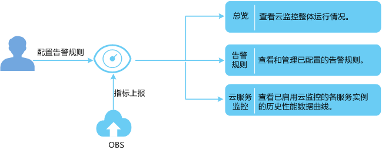

# Cloud Eye控制台监控指标

云监控（Cloud Eye）管理控制台支持监控的OBS指标如[表1](#table128512311216)所示。

**图 1**  云监控示意图  

**表 1**  OBS监控指标

<table><thead align="left"><tr id="row208519234123"><th class="cellrowborder" valign="top" width="33.33333333333333%" id="mcps1.2.4.1.1">
指标名称

</th>
<th class="cellrowborder" valign="top" width="33.33333333333333%" id="mcps1.2.4.1.2">
含义

</th>
<th class="cellrowborder" valign="top" width="33.33333333333333%" id="mcps1.2.4.1.3">
取值范围

</th>
</tr>
</thead>
<tbody><tr id="row785132321213"><td class="cellrowborder" valign="top" width="33.33333333333333%" headers="mcps1.2.4.1.1 ">
下载流量

</td>
<td class="cellrowborder" valign="top" width="33.33333333333333%" headers="mcps1.2.4.1.2 ">
该指标用于统计所有桶的所有下载请求响应的字节数，包括http body体。以字节为单位。

</td>
<td class="cellrowborder" valign="top" width="33.33333333333333%" headers="mcps1.2.4.1.3 ">
≥ 0 Byte

</td>
</tr>
<tr id="row5101162341218"><td class="cellrowborder" valign="top" width="33.33333333333333%" headers="mcps1.2.4.1.1 ">
上传流量

</td>
<td class="cellrowborder" valign="top" width="33.33333333333333%" headers="mcps1.2.4.1.2 ">
该指标用于统计所有桶的所有上传请求消息体的字节数，包括http body体。以字节为单位。

</td>
<td class="cellrowborder" valign="top" width="33.33333333333333%" headers="mcps1.2.4.1.3 ">
≥ 0 Byte

</td>
</tr>
<tr id="row14101023201219"><td class="cellrowborder" valign="top" width="33.33333333333333%" headers="mcps1.2.4.1.1 ">
GET类请求次数

</td>
<td class="cellrowborder" valign="top" width="33.33333333333333%" headers="mcps1.2.4.1.2 ">
该指标用于统计所有桶及桶中对象的GET/HEAD/OPTIONS请求次数。以次为单位。

</td>
<td class="cellrowborder" valign="top" width="33.33333333333333%" headers="mcps1.2.4.1.3 ">
≥ 0 Counts

</td>
</tr>
<tr id="row410122331215"><td class="cellrowborder" valign="top" width="33.33333333333333%" headers="mcps1.2.4.1.1 ">
PUT类请求次数

</td>
<td class="cellrowborder" valign="top" width="33.33333333333333%" headers="mcps1.2.4.1.2 ">
该指标用于统计所有桶及桶中对象的PUT/POST/DELETE请求次数。以次为单位。

</td>
<td class="cellrowborder" valign="top" width="33.33333333333333%" headers="mcps1.2.4.1.3 ">
≥ 0 Counts

</td>
</tr>
<tr id="row61017239122"><td class="cellrowborder" valign="top" width="33.33333333333333%" headers="mcps1.2.4.1.1 ">
GET类请求首字节平均时延

</td>
<td class="cellrowborder" valign="top" width="33.33333333333333%" headers="mcps1.2.4.1.2 ">
该指标用于统计GET/HEAD/OPTIONS操作，在一个统计周期内从系统收到完整请求到开始返回响应的耗时平均值。

</td>
<td class="cellrowborder" valign="top" width="33.33333333333333%" headers="mcps1.2.4.1.3 ">
≥ 0 ms

</td>
</tr>
<tr id="row374382021417"><td class="cellrowborder" valign="top" width="33.33333333333333%" headers="mcps1.2.4.1.1 ">
4xx错误次数

</td>
<td class="cellrowborder" valign="top" width="33.33333333333333%" headers="mcps1.2.4.1.2 ">
该指标用于统计服务端响应错误状态码为4xx的请求数。以次为单位。

</td>
<td class="cellrowborder" valign="top" width="33.33333333333333%" headers="mcps1.2.4.1.3 ">
≥ 0 Counts

</td>
</tr>
<tr id="row310115233127"><td class="cellrowborder" valign="top" width="33.33333333333333%" headers="mcps1.2.4.1.1 ">
5xx错误次数

</td>
<td class="cellrowborder" valign="top" width="33.33333333333333%" headers="mcps1.2.4.1.2 ">
该指标用于统计服务端响应错误状态码为5xx的请求数。以次为单位。

</td>
<td class="cellrowborder" valign="top" width="33.33333333333333%" headers="mcps1.2.4.1.3 ">
≥ 0 Counts

</td>
</tr>
</tbody>
</table>

## 操作步骤

1.  登录华为云管理控制台。
2.  选择“服务列表\>管理与部署\>云监控”，登录云监控管理控制台。
3.  请参考云监控服务的[创建告警规则](https://support.huaweicloud.com/usermanual-ces/zh-cn_topic_0084572213.html)，配置OBS的云监控。

