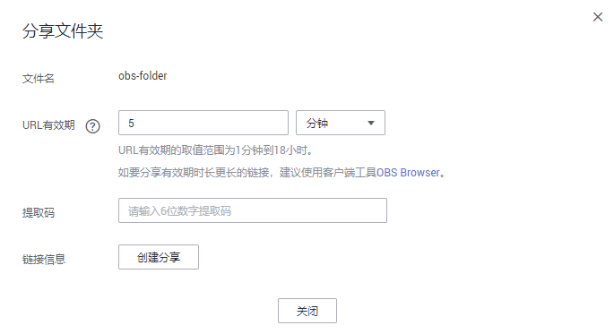

# 分享文件夹

## 操作场景

您可以使用文件夹分享功能，将OBS中的整个文件夹分享给所有用户。

## 背景知识

文件夹分享强调临时性，存在有效期。分享者需要先设置一个6位数的提取码，再创建分享。创建成功后，OBS会自动将文件夹中的所有对象的下载链接汇总到一个静态网站中，并托管到一个公共的OBS桶。所有用户均可使用创建分享时生成的临时URL和提取码，访问这个静态网站，并进行文件下载。

## 约束与限制

-   通过OBS控制台分享的文件夹，有效期的范围为1分钟到18小时。如果想要设置更长的有效期，建议使用客户端工具OBS Browser+，OBS Browser+支持1分钟到30天的有效期。如果想要设置永久的权限，请通过[桶策略或对象策略](桶策略和对象策略.md)实现。
-   仅部分区域支持文件夹分享功能，请以各区域实际情况为准。
-   仅桶版本号为3.0的桶支持文件夹分享功能。桶版本号可以在桶概览页的“基本信息”中查看。
-   归档存储对象需在原桶恢复后才能下载。

## 操作步骤

1.  在OBS管理控制台左侧导航栏选择“对象存储“。
2.  在桶列表单击待操作的桶，进入“概览”页面。
3.  在左侧导航栏，单击“对象”。
4.  选中待分享的文件夹，并单击右侧的“分享”，系统弹出“分享文件夹”对话框。

    **图 1**  分享文件夹  
    

5.  设置相关参数。

    **表 1**  分享文件夹参数

    
    <table><thead align="left"><tr id="row1693191125913"><th class="cellrowborder" valign="top" width="30.680000000000003%" id="mcps1.2.3.1.1">
参数

    </th>
    <th class="cellrowborder" valign="top" width="69.32000000000001%" id="mcps1.2.3.1.2">
说明

    </th>
    </tr>
    </thead>
    <tbody><tr id="row9931511596"><td class="cellrowborder" valign="top" width="30.680000000000003%" headers="mcps1.2.3.1.1 ">
URL有效期

    </td>
    <td class="cellrowborder" valign="top" width="69.32000000000001%" headers="mcps1.2.3.1.2 ">
单位为分钟或小时，URL有效期的取值范围为1分钟到18小时，默认值为5分钟。

    
在“URL有效期”内，任何用户都可以访问该文件夹。

    </td>
    </tr>
    <tr id="row593115111597"><td class="cellrowborder" valign="top" width="30.680000000000003%" headers="mcps1.2.3.1.1 ">
提取码

    </td>
    <td class="cellrowborder" valign="top" width="69.32000000000001%" headers="mcps1.2.3.1.2 ">
六位数字。

    
用户在访问分享链接时，需要输入提取码，才能看到文件夹中的对象。

    </td>
    </tr>
    </tbody>
    </table>

6.  单击“创建分享”，生成文件分享URL。
7.  您可以将链接及提取码发送给所有用户，用户通过访问链接并输入提取码以访问文件夹中的对象。

## 验证

其他用户通过网页访问分享的文件夹。

1.  打开网页，输入分享的URL地址，打开链接。
2.  在页面提示框输入“提取码”，确认即可访问分享的文件夹。

其他用户通过OBS Browser+访问分享的文件夹。

1.  打开OBS Browser+。
2.  在登录页面选择“授权码登录”。
3.  输入“授权码”和“提取码”。
4.  单击“登录”，即可访问分享的文件夹。

