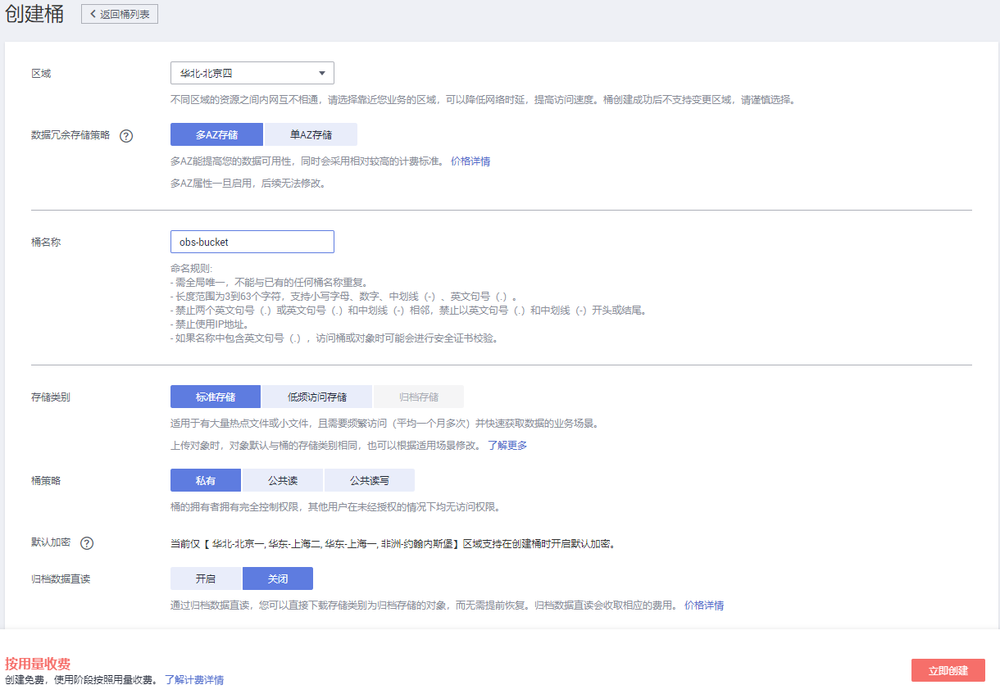
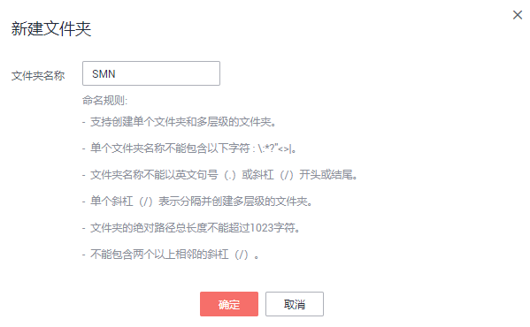
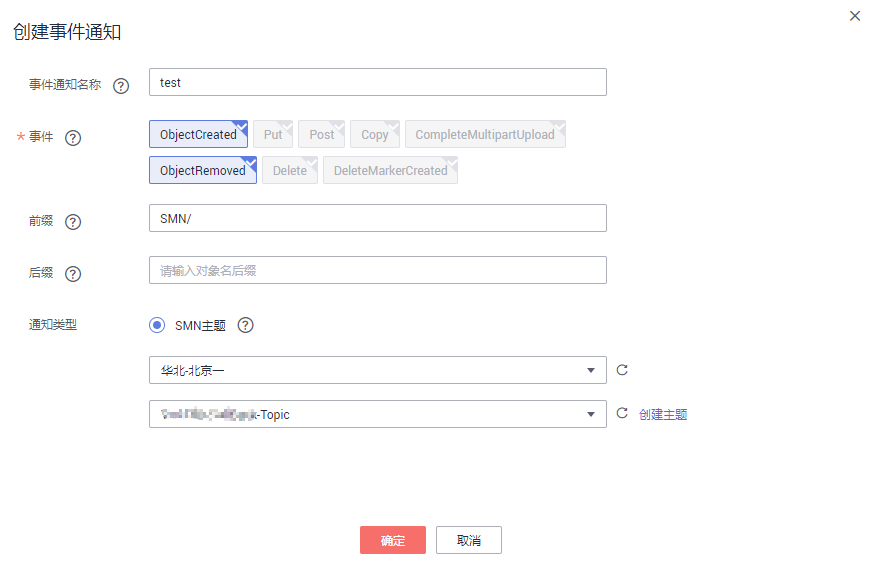

# 应用举例：配置事件通知

## 背景信息

假设某企业日常有大量工作文件需要存档，但并不希望花费大量的人力、物力在存储资源上。因此该企业开通了OBS，用于存储日常工作文件，并希望在OBS上进行的所有允许事件通知的操作，均能通过邮件的方式及时通知到企业某员工。

## 配置步骤

1.  以企业用户登录OBS管理控制台。
2.  创建桶。

    在页面左上角点击“创建桶”，如[图1](#fig35806698194939)所示。选择“区域”，选择“存储类别”，输入“桶名称”，并单击“立即创建”。

    **图 1**  创建桶  
    

3.  创建文件夹。

    单击[步骤2](#li29947515)中创建的桶名，进入“概览”页面。单击“对象\> 新建文件夹”，如输入文件夹名称，并单击“确定”，如[图2](#fig28070790193136)所示。这里以创建的文件夹名为“SMN”为例。

    **图 2**  创建文件夹  
    

4.  单击页面上方“服务列表”并选择“消息通知服务”进入消息通知服务页面创建SMN主题。这里假设创建的SMN主题名为“TestTopic”，消息通知方式为邮件。

    使用SMN服务创建用于OBS消息通知主题的流程为：

    1.  创建SMN主题。
    2.  添加主题订阅。
    3.  修改主题策略。必须勾选“主题访问策略”页面中的“可发布消息的服务”参数下的“OBS”。

    详细的使用SMN服务的操作指导请参见[表1](配置事件通知.md#aobs_console_0039_mmccppss_table01)中的主题部分。

5.  单击页面上方“服务列表”并选择“对象存储服务”返回OBS页面。
6.  配置事件通知。

    在桶列表中选择[步骤2](#li29947515)中创建的桶，单击“事件通知\>增加”，如[图3](#fig7766139195642)所示添加事件通知策略，并单击“确定”。

    按照下图所示配置的事件通知策略，企业用户往桶“testbucket”中的文件夹“SMN”中进行的所有允许事件通知的操作，均能通过邮件的方式及时通知到企业某员工。事件通知策略的详细参数解释请参见[表1](配置事件通知.md#aobs_console_0039_mmccppss_table01)。

    > **说明：**   
    >文件夹是以“/”结尾的，“/”前的字符为文件夹名称。对文件夹的相关操作做事件通知时，若要匹配后缀，后缀必须以“/”结尾。  

    **图 3**  配置事件通知  
    

## 验证配置是否成功

1.  以企业用户登录OBS管理控制台。
2.  上传一个名为“test.txt”的文件到[步骤3](#li44157757145057)创建的文件夹中。

    文件上传成功后，企业某员工应接收到类似[图4](#fig1183879515218)的邮件通知。邮件中的关键内容为“ObjectCreated:Post”表示对象上传成功。

    **图 4**  上传对象邮件详情  
    

3.  删除[步骤2](#li38214839153354)中上传的“test.txt”文件。

    删除文件成功后。企业某员工应接收到类似[图5](#fig36929030152112)的邮件通知。邮件中的关键内容为“ObjectRemoved:DeleteMarkerCreated”表示对象删除成功。

    **图 5**  删除对象邮件详情  
    

