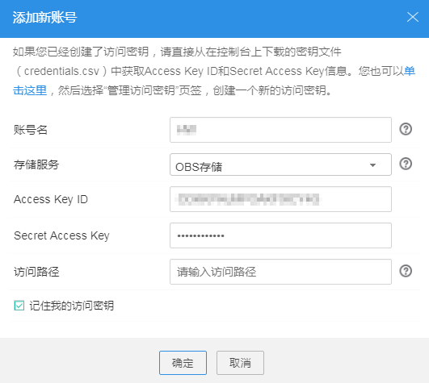

# 桶拥有者为IAM用户授予桶权限

在主账号下创建一个IAM用户，IAM用户不加入任何用户组，该IAM用户没有任何权限。桶拥有者（主账号）可以通过配置桶策略授予IAM用户桶的权限。

下面示例中，主账号授予IAM用户访问桶和上传对象的权限。

## 操作步骤

1.  在OBS管理控制台左侧导航栏选择“对象存储“。
2.  在桶列表单击待操作的桶，进入“概览”页面。
3.  在左侧导航栏，单击“访问权限控制”，进入权限管理页面。
4.  单击“桶策略\>高级桶策略”。
5.  单击“创建桶策略”，系统弹出“创建桶策略”对话框。
6.  配置如下参数，授予IAM用户访问桶的权限。

    **表 1**  授予访问桶的权限的参数配置

    
    <table><thead align="left"><tr id="row2532105311447"><th class="cellrowborder" valign="top" width="23.189999999999998%" id="mcps1.2.3.1.1">
参数

    </th>
    <th class="cellrowborder" valign="top" width="76.81%" id="mcps1.2.3.1.2">
取值

    </th>
    </tr>
    </thead>
    <tbody><tr id="row953216536449"><td class="cellrowborder" valign="top" width="23.189999999999998%" headers="mcps1.2.3.1.1 ">
策略模式

    </td>
    <td class="cellrowborder" valign="top" width="76.81%" headers="mcps1.2.3.1.2 ">
自定义模式

    </td>
    </tr>
    <tr id="row16532753114417"><td class="cellrowborder" valign="top" width="23.189999999999998%" headers="mcps1.2.3.1.1 ">
效果

    </td>
    <td class="cellrowborder" valign="top" width="76.81%" headers="mcps1.2.3.1.2 ">
Allow

    </td>
    </tr>
    <tr id="row115321753164415"><td class="cellrowborder" valign="top" width="23.189999999999998%" headers="mcps1.2.3.1.1 ">
被授权用户

    </td>
    <td class="cellrowborder" valign="top" width="76.81%" headers="mcps1.2.3.1.2 "><ul id="ul136938242519"><li>包含</li><li>当前账号，并选择需要授权的IAM用户</li></ul>
    </td>
    </tr>
    <tr id="row653285374414"><td class="cellrowborder" valign="top" width="23.189999999999998%" headers="mcps1.2.3.1.1 ">
资源

    </td>
    <td class="cellrowborder" valign="top" width="76.81%" headers="mcps1.2.3.1.2 "><ul id="ul964933612542"><li>包含</li><li>资源名称不配置</li></ul>
    </td>
    </tr>
    <tr id="row18790945165418"><td class="cellrowborder" valign="top" width="23.189999999999998%" headers="mcps1.2.3.1.1 ">
动作

    </td>
    <td class="cellrowborder" valign="top" width="76.81%" headers="mcps1.2.3.1.2 "><ul id="ul815102155519"><li>包含</li><li>ListBucket</li></ul>
    </td>
    </tr>
    </tbody>
    </table>

7.  单击“确定”。
8.  单击“创建桶策略”，系统弹出“创集桶策略”对话框。
9.  配置如下参数，授予IAM用户上传对象的权限。

    > **说明：**   
    >授予用户对象操作权限前，需先授予其访问桶的权限。  

    **表 2**  授予上传对象的权限的参数配置

    
    <table><thead align="left"><tr id="row16664826175610"><th class="cellrowborder" valign="top" width="22.98%" id="mcps1.2.3.1.1">
参数

    </th>
    <th class="cellrowborder" valign="top" width="77.02%" id="mcps1.2.3.1.2">
取值

    </th>
    </tr>
    </thead>
    <tbody><tr id="row12665142619562"><td class="cellrowborder" valign="top" width="22.98%" headers="mcps1.2.3.1.1 ">
策略模式

    </td>
    <td class="cellrowborder" valign="top" width="77.02%" headers="mcps1.2.3.1.2 ">
自定义模式

    </td>
    </tr>
    <tr id="row3667132613567"><td class="cellrowborder" valign="top" width="22.98%" headers="mcps1.2.3.1.1 ">
效果

    </td>
    <td class="cellrowborder" valign="top" width="77.02%" headers="mcps1.2.3.1.2 ">
Allow

    </td>
    </tr>
    <tr id="row666915260561"><td class="cellrowborder" valign="top" width="22.98%" headers="mcps1.2.3.1.1 ">
被授权用户

    </td>
    <td class="cellrowborder" valign="top" width="77.02%" headers="mcps1.2.3.1.2 "><ul id="ul1670726135620"><li>包含</li><li>当前账号，并选择需要授权的IAM用户</li></ul>
    </td>
    </tr>
    <tr id="row126721226135618"><td class="cellrowborder" valign="top" width="22.98%" headers="mcps1.2.3.1.1 ">
资源

    </td>
    <td class="cellrowborder" valign="top" width="77.02%" headers="mcps1.2.3.1.2 "><ul id="ul11674152619564"><li>包含</li><li>资源名称：*</li></ul>
    </td>
    </tr>
    <tr id="row167522618569"><td class="cellrowborder" valign="top" width="22.98%" headers="mcps1.2.3.1.1 ">
动作

    </td>
    <td class="cellrowborder" valign="top" width="77.02%" headers="mcps1.2.3.1.2 "><ul id="ul176761226135619"><li>包含</li><li>PutObject</li></ul>
    </td>
    </tr>
    </tbody>
    </table>

10. 单击“确定”。

## 验证

使用OBS Browser用来验证以上授权。

1.  在管理控制台上创建被授权用户的AK/SK。
2.  打开OBS Browser，配置已获取到的AK/SK，并设置“访问路径”为授权的桶名称。

    **图 1**  添加新账号-OBS存储  
    

3.  当主账号未授权给用户访问桶权限时，用户用OBS Browser访问桶时，被拒绝访问。
4.  主账号配置授予给用户访问桶权限后，用户可以用OBS Browser登录访问桶，桶界面正常显示桶中对象。
5.  此时上传对象到桶中，上传失败。单击页面右上角的，进入“任务管理”界面，“状态”为“失败”，失败原因为“拒绝访问”。
6.  主账号配置授予给用户上传对象权限后，用户用OBS Browser上传对象成功，对象在对象列表中显示。

