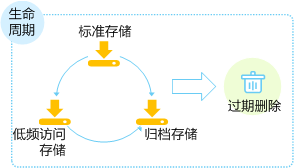

# 生命周期管理简介

生命周期管理是指通过配置指定的规则，实现定时删除桶中的对象或者定时转换对象的存储类别。

**图 1**  生命周期管理示意图  

生命周期管理可适用于以下典型场景：

-   周期性上传的日志文件，可能只需要保留一个星期或一个月。到期后要删除它们。
-   某些文档在一段时间内经常访问，但是超过一定时间后便可能不再访问了。这些文档需要在一定时间后转化为低频访问存储，归档存储或者删除。

对于上述场景中的对象，您可以定义用于识别这些对象的生命周期管理规则，通过这些规则实现对象的生命周期管理。

自动将某些不再频繁访问的对象转换为低频访问存储或者归档存储，可以减少您的租赁费用。此处的“转换”表示在不复制原对象的情况下修改对象的存储类别。您可以在对象页面手动修改对象的存储类别，详情请参见[上传文件](上传文件.md)的相关操作，也可以通过配置生命周期规则转换对象的存储类别。两种方法的差异见[对象存储类别简介](对象存储类别简介.md)。

生命周期管理规则通常包含两个关键要素：

-   策略：即您可以指定对象名前缀来匹配受约束的对象，则匹配该前缀的对象将受规则影响；也可以指定将生命周期管理规则配置到整个桶，则桶内所有对象都将受规则影响。
-   时间：即您可以指定在对象最后一次更新后多少天，受规则影响的对象将转换为低频访问存储、归档存储或者过期并自动被OBS删除。
    -   转换为低频访问存储：即您可以指定在对象最后一次更新后多少天，受规则影响的对象将转换为低频访问存储。
    -   转换为归档存储：即您可以指定在对象最后一次更新后多少天，受规则影响的对象将转换为归档存储。
    -   过期删除：即您可以指定在对象最后一次更新后多少天，受规则影响的对象将过期并自动被OBS删除。

转换为低频访问存储的时间最少设置为30天，若同时设置转换为低频访问存储和转换为归档存储，则转换为归档存储的时间要比转换为低频访问存储的时间至少长30天，例如转换为低频访问存储设置为33天，则转换为归档存储至少需要设置为63天。若单独设置转换为归档存储，则没有时间限制。过期时间必须大于前两个转换时间的最大值。

