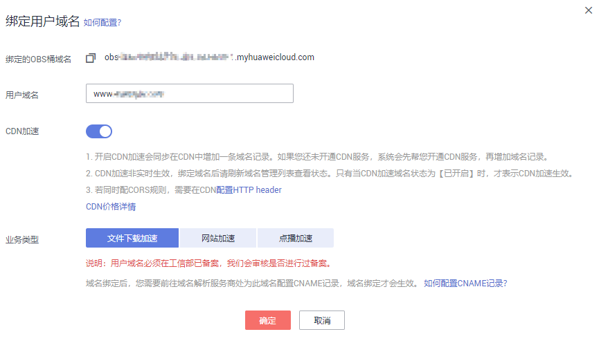

# 自定义域名绑定配置<a name="obs_03_0032"></a>

## 前提条件<a name="section16552733193411"></a>

用户已创建桶并上传了网站文件。

## 操作步骤<a name="section541719774011"></a>

1.  在OBS管理控制台左侧导航栏选择“对象存储“。
2.  在桶列表单击待操作的桶，进入“概览”页面。
3.  在左侧导航栏选择“域名管理”，进入“域名管理”界面。
4.  单击“绑定用户域名”，绑定自定义域名到桶域名，如[图1](#fig53010339108)所示。

    **图 1**  绑定用户域名<a name="fig53010339108"></a>  
    

5.  （可选）配置CDN加速。

    开启CDN加速后，可配置网站加速、文件下载加速和点播加速。详细应用场景请参见[应用场景](https://support.huaweicloud.com/productdesc-cdn/zh-cn_topic_0064907764.html)。通过CDN实现OBS文件下载加速的详细配置方法请参见[最佳实践](https://support.huaweicloud.com/bestpractice-obs/obs_05_0520.html)。

    > **说明：**   
    >CDN加速需收费，具体请参见[CDN价格说明](https://www.huaweicloud.com/pricing.html?tab=detail#/cdn)。同时OBS提供更加优惠的回源流量包，可以减少CDN加速场景下获取数据时产生的流量费用。  
    >配置生效后，需要等待约5分钟才能使用CDN自动刷新缓存。  

6.  单击“确定”。
7.  在域名解析服务器上配置CNAME记录，将用户自定义域名（例如www.example.com）映射成桶域名。若您配置了CDN加速，CNAME通过域名管理界面“CNAME域名”列获取。

    不同DNS服务商的CNAME配置方式不同，此处以华为云云解析服务为例。其他DNS服务商的CNAME配置方法可参考[配置CNAME（非华为云DNS）](https://support.huaweicloud.com/usermanual-cdn/cdn_01_0032.html)。

    若您使用的是DNS服务商为华为云，您可通过如下步骤配置CNAME记录。

    1.  登录华为云控制台，在控制台首页选择“网络 \> 云解析服务 DNS”，进入云解析服务页面。
    2.  在左侧菜单栏中，选择“域名解析 \> 公网解析”，进入域名列表页面。
    3.  在待添加记录集的域名所在行，单击“域名”列的域名名称。
    4.  单击“添加记录集”，进入“添加记录集”页面。
    5.  根据界面提示填写参数配置，参数信息如[表1](#table18826111120149)所示。下表中未提到的参数可保持默认值。

        **表 1**  参数说明

        <a name="table18826111120149"></a>
        <table><thead align="left"><tr id="row17826121181414"><th class="cellrowborder" valign="top" width="22%" id="mcps1.2.4.1.1"><p id="p13826191112144"><a name="p13826191112144"></a><a name="p13826191112144"></a>参数</p>
        </th>
        <th class="cellrowborder" valign="top" width="45%" id="mcps1.2.4.1.2"><p id="p9826911171417"><a name="p9826911171417"></a><a name="p9826911171417"></a>参数说明</p>
        </th>
        <th class="cellrowborder" valign="top" width="33%" id="mcps1.2.4.1.3"><p id="p1682651115148"><a name="p1682651115148"></a><a name="p1682651115148"></a>取值样例</p>
        </th>
        </tr>
        </thead>
        <tbody><tr id="row1482616114141"><td class="cellrowborder" valign="top" width="22%" headers="mcps1.2.4.1.1 "><p id="p2049713718147"><a name="p2049713718147"></a><a name="p2049713718147"></a>主机记录</p>
        </td>
        <td class="cellrowborder" valign="top" width="45%" headers="mcps1.2.4.1.2 "><p id="p13497737141414"><a name="p13497737141414"></a><a name="p13497737141414"></a>主机记录指域名前缀。</p>
        </td>
        <td class="cellrowborder" valign="top" width="33%" headers="mcps1.2.4.1.3 "><p id="p17497183716145"><a name="p17497183716145"></a><a name="p17497183716145"></a>www</p>
        </td>
        </tr>
        <tr id="row782611119144"><td class="cellrowborder" valign="top" width="22%" headers="mcps1.2.4.1.1 "><p id="p204971037131414"><a name="p204971037131414"></a><a name="p204971037131414"></a>类型</p>
        </td>
        <td class="cellrowborder" valign="top" width="45%" headers="mcps1.2.4.1.2 "><p id="p11497437181411"><a name="p11497437181411"></a><a name="p11497437181411"></a>记录集的类型，此处为CNAME类型。</p>
        </td>
        <td class="cellrowborder" valign="top" width="33%" headers="mcps1.2.4.1.3 "><p id="p24975374144"><a name="p24975374144"></a><a name="p24975374144"></a>CNAME-将域名指向另外一个域名</p>
        </td>
        </tr>
        <tr id="row164371135458"><td class="cellrowborder" valign="top" width="22%" headers="mcps1.2.4.1.1 "><p id="p1245013504286"><a name="p1245013504286"></a><a name="p1245013504286"></a>别名</p>
        </td>
        <td class="cellrowborder" valign="top" width="45%" headers="mcps1.2.4.1.2 "><p id="p184507500283"><a name="p184507500283"></a><a name="p184507500283"></a>用于是否将此记录集关联至云服务资源实例。</p>
        </td>
        <td class="cellrowborder" valign="top" width="33%" headers="mcps1.2.4.1.3 "><p id="p13450850102815"><a name="p13450850102815"></a><a name="p13450850102815"></a>否</p>
        </td>
        </tr>
        <tr id="row482661141419"><td class="cellrowborder" valign="top" width="22%" headers="mcps1.2.4.1.1 "><p id="p174974374146"><a name="p174974374146"></a><a name="p174974374146"></a>线路类型</p>
        </td>
        <td class="cellrowborder" valign="top" width="45%" headers="mcps1.2.4.1.2 "><p id="p749743771417"><a name="p749743771417"></a><a name="p749743771417"></a>用于DNS服务器在解析域名时，根据访问者的来源，返回对应的服务器IP地址。</p>
        <p id="p94971037171418"><a name="p94971037171418"></a><a name="p94971037171418"></a>添加解析线路类型时，切记先添加默认线路类型，以保证网站可访问。</p>
        </td>
        <td class="cellrowborder" valign="top" width="33%" headers="mcps1.2.4.1.3 "><p id="p4497937181412"><a name="p4497937181412"></a><a name="p4497937181412"></a>全网默认</p>
        </td>
        </tr>
        <tr id="row8826181119146"><td class="cellrowborder" valign="top" width="22%" headers="mcps1.2.4.1.1 "><p id="p15497113717145"><a name="p15497113717145"></a><a name="p15497113717145"></a>TTL(秒)</p>
        </td>
        <td class="cellrowborder" valign="top" width="45%" headers="mcps1.2.4.1.2 "><p id="p1349713714147"><a name="p1349713714147"></a><a name="p1349713714147"></a>记录集的有效缓存时间，以秒为单位。</p>
        </td>
        <td class="cellrowborder" valign="top" width="33%" headers="mcps1.2.4.1.3 "><p id="p749718376142"><a name="p749718376142"></a><a name="p749718376142"></a>默认为“5分钟”，即300s。</p>
        </td>
        </tr>
        <tr id="row1882621121414"><td class="cellrowborder" valign="top" width="22%" headers="mcps1.2.4.1.1 "><p id="p1549773711419"><a name="p1549773711419"></a><a name="p1549773711419"></a>值</p>
        </td>
        <td class="cellrowborder" valign="top" width="45%" headers="mcps1.2.4.1.2 "><p id="p16639155285514"><a name="p16639155285514"></a><a name="p16639155285514"></a>需指向的域名。</p>
        </td>
        <td class="cellrowborder" valign="top" width="33%" headers="mcps1.2.4.1.3 "><p id="p1521120105620"><a name="p1521120105620"></a><a name="p1521120105620"></a>若没有开启CDN加速，该值为桶访问域名；若开启CDN加速后，该值为CDN分配的CNAME域名。</p>
        </td>
        </tr>
        </tbody>
        </table>

    6.  单击“确定”，完成添加。
    7.  验证CNAME配置是否生效。

        打开Windows操作系统中的cmd程序，输入如下指令：

        ```
        nslookup -qt=cname 桶绑定的自定义域名
        ```

        如果回显CDN分配的CNAME域名，则表示CNAME配置已经生效。


