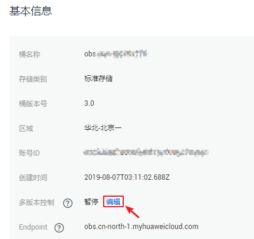
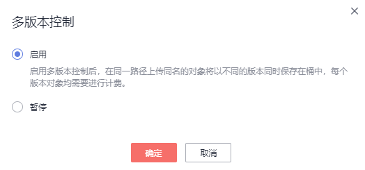

# 配置多版本控制

## 操作步骤

1.  在OBS管理控制台左侧导航栏选择“对象存储“。
2.  在桶列表单击待操作的桶，进入“概览”页面。
3.  鼠标滑过“基本信息”区域“多版本控制”参数后面的“未启用”、“暂停”或“已启用”，在右侧会显示“编辑”按钮。单击“编辑”，系统弹出多版本控制对话框。

    **图 1**  配置多版本控制入口  
    

4.  选择“启用”，如[图2](#fig17030850192918)所示。

    **图 2**  多版本控制  
    

5.  单击“确定”，启用目标桶中对象的多版本控制。
6.  单击待查看的对象，进入对象详情页面。在“版本”页签，查看一个对象的多个版本。

## 相关操作

开启多版本控制后，进入对象详情页面，在“版本”页签，可以对多版本对象进行删除、下载操作。

1.  在OBS管理控制台左侧导航栏选择“对象存储“。
2.  在桶列表单击待操作的桶，进入“概览”页面。
3.  在左侧导航栏选中“对象”。
4.  在“对象”列表，选择待操作的对象，进入对象详情页面。
5.  在“版本”页签，显示该对象的所有版本。
6.  对多版本对象可做以下操作。
    1.  在待操作版本对象右侧，单击“下载”，可下载该版本对象。

        > **说明：** 
        >若该版本对象为“归档存储”类别，需要先恢复，再下载。

    2.  在待操作版本对象右侧，单击“分享”，可分享该版本对象。
    3.  在待操作版本对象右侧，单击“删除”，将永久删除该版本对象，不可恢复。若删除的是最新版本的对象，那么时间最近的历史版本将变成新的最新版本。

