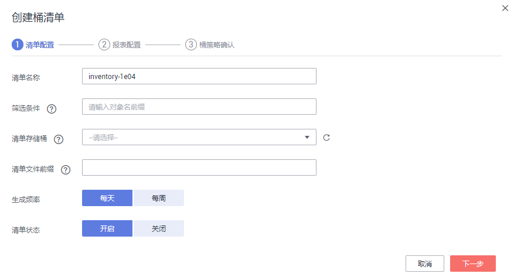
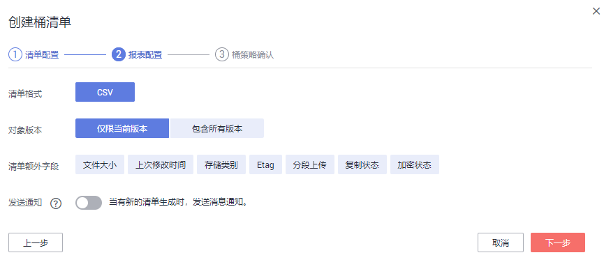

# 配置桶清单

## 操作步骤

1.  在OBS管理控制台左侧导航栏选择“对象存储“。
2.  在桶列表单击待操作的桶，进入“概览”页面。
3.  在左侧导航栏，单击“桶清单”进入“桶清单”页面。
4.  单击“创建桶清单”，系统弹出“创建桶清单”对话框。

    **图 1**  清单配置  
    

5.  设置“清单配置”相关参数。

    **表 1**  清单配置参数说明

    
    <table><thead align="left"><tr id="row966620399131"><th class="cellrowborder" valign="top" width="29.360000000000003%" id="mcps1.2.3.1.1">
参数

    </th>
    <th class="cellrowborder" valign="top" width="70.64%" id="mcps1.2.3.1.2">
描述

    </th>
    </tr>
    </thead>
    <tbody><tr id="row5666439141316"><td class="cellrowborder" valign="top" width="29.360000000000003%" headers="mcps1.2.3.1.1 ">
清单名称

    </td>
    <td class="cellrowborder" valign="top" width="70.64%" headers="mcps1.2.3.1.2 ">
桶清单的名称。

    </td>
    </tr>
    <tr id="row126661839151316"><td class="cellrowborder" valign="top" width="29.360000000000003%" headers="mcps1.2.3.1.1 ">
筛选条件

    </td>
    <td class="cellrowborder" valign="top" width="70.64%" headers="mcps1.2.3.1.2 ">
桶清单筛选条件，OBS会为筛选出来的对象生成清单。

    
目前仅支持通过对象名前缀进行筛选；或者不输入，表示对桶中所有对象生成清单。

    
同一个桶中多条清单规则的筛选条件不能彼此包含。

    </td>
    </tr>
    <tr id="row366623919135"><td class="cellrowborder" valign="top" width="29.360000000000003%" headers="mcps1.2.3.1.1 ">
清单存储桶

    </td>
    <td class="cellrowborder" valign="top" width="70.64%" headers="mcps1.2.3.1.2 ">
存储桶清单文件的桶，只能选择与源桶相同区域的桶。

    </td>
    </tr>
    <tr id="row1966683971315"><td class="cellrowborder" valign="top" width="29.360000000000003%" headers="mcps1.2.3.1.1 ">
清单文件前缀

    </td>
    <td class="cellrowborder" valign="top" width="70.64%" headers="mcps1.2.3.1.2 ">
清单文件的存储路径前缀。

    
清单文件生成后，将存储至清单存储桶的以下路径：清单文件前缀/源桶名/清单名称/日期时间/files/

    
如不配置此参数，上述路径的一级目录“清单文件前缀”将由系统自动生成并命名为“BucketInventory”。

    </td>
    </tr>
    <tr id="row1066613981316"><td class="cellrowborder" valign="top" width="29.360000000000003%" headers="mcps1.2.3.1.1 ">
生成频率

    </td>
    <td class="cellrowborder" valign="top" width="70.64%" headers="mcps1.2.3.1.2 ">
设定桶清单的生成频率：每天或每周。

    </td>
    </tr>
    <tr id="row1416527122214"><td class="cellrowborder" valign="top" width="29.360000000000003%" headers="mcps1.2.3.1.1 ">
清单状态

    </td>
    <td class="cellrowborder" valign="top" width="70.64%" headers="mcps1.2.3.1.2 ">
开启，表示按照相关设置生成桶清单；关闭，表示不生成桶清单。

    </td>
    </tr>
    </tbody>
    </table>

6.  单击“下一步”，进入“报表配置”页面。

    **图 2**  报表配置  
    

7.  设置“报表格式”相关参数。

    **表 2**  报表格式参数说明

    
    <table><thead align="left"><tr id="row775813535231"><th class="cellrowborder" valign="top" width="29.360000000000003%" id="mcps1.2.3.1.1">
参数

    </th>
    <th class="cellrowborder" valign="top" width="70.64%" id="mcps1.2.3.1.2">
描述

    </th>
    </tr>
    </thead>
    <tbody><tr id="row1975845313233"><td class="cellrowborder" valign="top" width="29.360000000000003%" headers="mcps1.2.3.1.1 ">
清单格式

    </td>
    <td class="cellrowborder" valign="top" width="70.64%" headers="mcps1.2.3.1.2 ">
支持生成CVS格式的桶清单文件。

    </td>
    </tr>
    <tr id="row177581953152310"><td class="cellrowborder" valign="top" width="29.360000000000003%" headers="mcps1.2.3.1.1 ">
对象版本

    </td>
    <td class="cellrowborder" valign="top" width="70.64%" headers="mcps1.2.3.1.2 ">
报表中对象的版本，可以设置为“仅限当前版本”和“包含所有版本”。

    </td>
    </tr>
    <tr id="row16758115382312"><td class="cellrowborder" valign="top" width="29.360000000000003%" headers="mcps1.2.3.1.1 ">
清单额外字段

    </td>
    <td class="cellrowborder" valign="top" width="70.64%" headers="mcps1.2.3.1.2 ">
桶清单文件中包含的对象信息：文件大小、上次修改时间、存储类别、Etag、分段上传、复制状态、加密状态。

    </td>
    </tr>
    <tr id="row1993994314117"><td class="cellrowborder" valign="top" width="29.360000000000003%" headers="mcps1.2.3.1.1 ">
发送通知

    </td>
    <td class="cellrowborder" valign="top" width="70.64%" headers="mcps1.2.3.1.2 ">
当有新的清单生成时发送消息通知，消息将发送到SMN主题中指定的邮箱或手机等终端。

    
开启发送通知，会同步创建桶的SMN事件通知规则，所创建规则的详细信息可以在桶的SMN事件通知页面查看。关闭发送通知或修改通知的SMN主题，也会同步删除或修改已创建的SMN事件通知规则。

    </td>
    </tr>
    </tbody>
    </table>

8.  单击“下一步”，确认桶策略。

    OBS将在桶清单存储桶上创建桶策略，以允许其将清单文件存入该桶。

9.  单击“创建”。

