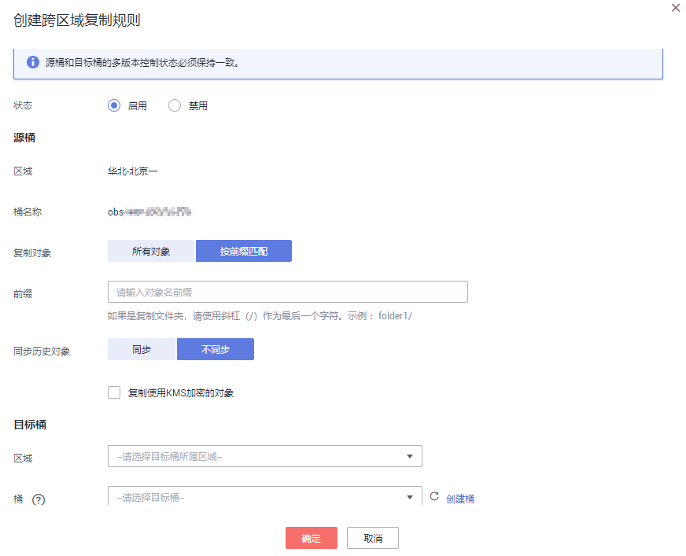

# 配置跨区域复制

当前，OBS支持一个源桶到一个目标桶配置一条复制所有对象的跨区域复制规则，或多条按前缀匹配的跨区域复制规则。

## 前提条件

源桶的版本号为3.0及以上，并且源桶所在区域支持跨区域复制功能。

## 操作步骤

1.  在OBS管理控制台左侧导航栏选择“对象存储“。
2.  在桶列表单击待操作的桶，进入“概览”页面。
3.  在左侧导航栏，单击“跨区域复制”。
4.  单击“创建规则”，系统将弹出“创建跨区域复制规则”对话框，如[图1](#fig63211341214612)所示。

    **图 1**  创建跨区域复制规则  
    

    > **说明：**   
    >-   源桶和目标桶的多版本控制状态必须保持一致。  
    >-   一个源桶的跨区域复制只能有一个目标桶和IAM委托，后面创建的规则中的目标桶和IAM委托会覆盖已创建规则的目标桶和委托。  

5.  根据业务规划配置跨区域复制规则，参数的详细说明如[表1](#table6195068921495)所示。

    **表 1**  跨区域复制规则参数

    
    <table><thead align="left"><tr id="row4965471321495"><th class="cellrowborder" colspan="2" valign="top" id="mcps1.2.4.1.1">
参数

    </th>
    <th class="cellrowborder" valign="top" id="mcps1.2.4.1.2">
说明

    </th>
    </tr>
    </thead>
    <tbody><tr id="row443080921495"><td class="cellrowborder" colspan="2" valign="top" headers="mcps1.2.4.1.1 ">
状态

    </td>
    <td class="cellrowborder" valign="top" headers="mcps1.2.4.1.2 ">
选择启用或者禁用当前规则。源桶和目标桶的多版本控制状态必须保持一致。

    </td>
    </tr>
    <tr id="row5981092521495"><td class="cellrowborder" rowspan="4" valign="top" width="10%" headers="mcps1.2.4.1.1 ">
源桶

    </td>
    <td class="cellrowborder" valign="top" width="25%" headers="mcps1.2.4.1.1 ">
复制对象

    </td>
    <td class="cellrowborder" valign="top" width="65%" headers="mcps1.2.4.1.2 ">
在源桶中选择要复制的对象。

    <ul id="ul34268730153058"><li>所有对象：复制所有对象到目标桶。</li><li>按前缀匹配：复制具有相同前缀的对象到目标桶。</li></ul>
    </td>
    </tr>
    <tr id="row1616511719513"><td class="cellrowborder" valign="top" headers="mcps1.2.4.1.1 ">
前缀

    </td>
    <td class="cellrowborder" valign="top" headers="mcps1.2.4.1.1 "><ul id="ul1420210213339"><li>按前缀匹配对象时，输入的对象名前缀不能为空，长度限制为1023个字节。</li><li>当按前缀配置时，如果指定的前缀名与某条已配置的规则指定的前缀名存在包含关系，OBS会将两条规则视为同一条，而禁止您配置本条规则。例如，系统中已存在指定前缀名为“abc”的规则，则不允许再配置指定前缀以“abc”字段开头的规则。</li><li>如果要复制文件夹，对象名前缀需要使用/作为最后一个字符（例如，imgs/）。</li></ul>
    </td>
    </tr>
    <tr id="row17174614446"><td class="cellrowborder" valign="top" headers="mcps1.2.4.1.1 ">
同步历史对象

    </td>
    <td class="cellrowborder" valign="top" headers="mcps1.2.4.1.1 ">
选择是否将创建本规则前已经存在于桶中的对象同步复制到目标桶，默认不同步。

    </td>
    </tr>
    <tr id="row24800168141541"><td class="cellrowborder" valign="top" headers="mcps1.2.4.1.1 ">
复制使用KMS加密的对象

    </td>
    <td class="cellrowborder" valign="top" headers="mcps1.2.4.1.1 ">
不论是否勾选，OBS均会尝试复制KMS加密对象。

    <ul id="ul16509103994016"><li>若勾选该项，下方的“IAM委托”仅会展示源端和目标端均有“KMS Administrator”权限的委托；</li><li>若不勾选该项，下方的IAM委托仅会展示源端或目标端没有“KMS Administrator”权限的委托。</li></ul>
    
如果目标区域没有启用KMS服务或者委托中没有赋予源桶和目标桶所在区域“KMS Administrator”权限，则源桶中KMS加密对象会复制失败，导致对象复制状态为FAILED。

    
源桶中以任意KMS密钥加密的对象，复制到目标桶后都会以目标桶所在区域的默认主密钥“obs/default”进行加密。

    </td>
    </tr>
    <tr id="row35500343215138"><td class="cellrowborder" rowspan="3" valign="top" width="10%" headers="mcps1.2.4.1.1 ">
目标桶

    </td>
    <td class="cellrowborder" valign="top" width="25%" headers="mcps1.2.4.1.1 ">
区域

    </td>
    <td class="cellrowborder" valign="top" width="65%" headers="mcps1.2.4.1.2 ">
选择目标桶所在区域，目标桶需要与源桶处于不同区域。

    </td>
    </tr>
    <tr id="row35168852215147"><td class="cellrowborder" valign="top" headers="mcps1.2.4.1.1 ">
桶

    </td>
    <td class="cellrowborder" valign="top" headers="mcps1.2.4.1.1 ">
选择目标桶。

    </td>
    </tr>
    <tr id="row59588754215140"><td class="cellrowborder" valign="top" headers="mcps1.2.4.1.1 ">
修改复制对象的存储类别

    </td>
    <td class="cellrowborder" valign="top" headers="mcps1.2.4.1.1 ">
默认不勾选，即保持与源桶中对象的存储类别一致。勾选后可以配置复制到目标桶的对象的存储类别。

    </td>
    </tr>
    <tr id="row63407147215331"><td class="cellrowborder" valign="top" width="10%" headers="mcps1.2.4.1.1 ">
权限

    </td>
    <td class="cellrowborder" valign="top" width="25%" headers="mcps1.2.4.1.1 ">
IAM委托

    </td>
    <td class="cellrowborder" valign="top" width="65%" headers="mcps1.2.4.1.2 ">
将您资源的操作权限委托给OBS，OBS使用此委托执行对象的跨区域复制。

    
您可以从下拉列表选择账号下已有的IAM委托，也可以单击“创建委托”去创建一个新的委托。

    
 说明： 

此IAM委托必须为“对象存储服务 OBS”的云服务委托。其中“对象存储服务”项目需要具有“Tenant Administrator”权限。如果勾选了“复制使用KMS加密的对象”，源桶和目标桶所在区域还需要具有“KMS Administrator”权限。

    

    </td>
    </tr>
    </tbody>
    </table>

6.  （可选）创建IAM委托，参见[创建IAM委托](创建IAM委托.md)。
7.  单击“确定”，完成跨区域复制规则创建。

