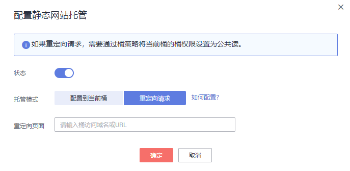

# 配置重定向请求

若需将该桶的所有请求重定向至其他桶或URL，可以配置重定向请求。

## 前提条件

静态网站所需的网页文件已上传到指定桶中。

如果静态网站文件为“归档存储”类别，则需要先恢复，具体操作步骤请参见[恢复归档存储文件](恢复归档存储文件.md)。

> **须知：** 
>如需将托管的静态网站对所有人开放，必须配置匿名用户可访问桶内的静态网站文件。静态网站托管配置会在两分钟内生效。

## 操作步骤

1.  在OBS管理控制台左侧导航栏选择“对象存储“。
2.  在桶列表单击待操作的桶，进入“概览”页面。
3.  在“基础配置”下，单击“静态网站托管”卡片，系统跳转至“静态网站托管”界面。

    或您可以直接在左侧导航栏单击“基础配置\>静态网站托管”，进入“静态网站托管”界面。

4.  单击“配置静态网站托管”，系统弹出“配置静态网站托管”对话框。
5.  “状态”设置为使能状态。
6.  “托管模式”选择“重定向请求”，如[图1](#fig1131112528711)所示。在“重定向页面”中输入桶访问域名或URL。

    **图 1**  配置重定向请求  
    

7.  单击“确定”。
8.  单击“桶列表”，选择重定向的桶。
9.  **可选**：若静态网站需对所有人开放，配置如下策略，使桶内静态网站文件能被公开访问。

    参考[为匿名用户设置对象的访问权限](为匿名用户设置对象的访问权限.md)为匿名用户授予静态网站文件的读取权限。

    若桶中只有静态网站文件，则配置桶的“公共读”权限，使桶内所有文件能被公开访问。

    1.  单击“访问权限控制\>桶策略”。
    2.  在“标准桶策略”下配置桶的“公共读”权限。
    3.  单击“公共读”卡片，如[图2](#zh-cn_topic_0045829093_fig15186794193556)所示。并在弹出的确认信息对话框中单击“是”。

        **图 2**  配置公共读权限  
        

10. **验证**：在浏览器输入本桶的访问域名，结果显示为重定向的桶或重定向的URL。

    > **说明：** 
    >由于浏览器缓存等原因，您可能需要清除浏览器缓存后才能查看到预期效果。

