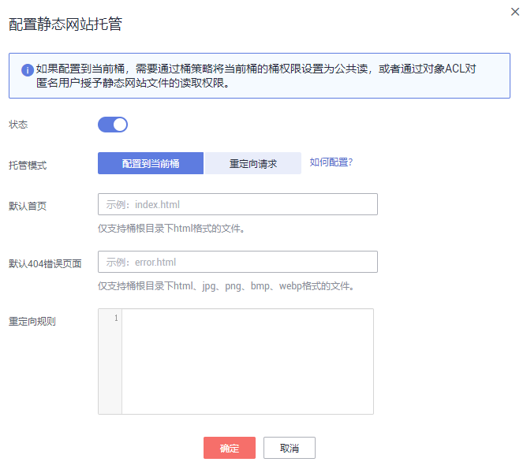

# 配置静态网站托管<a name="zh-cn_topic_0045829093"></a>

用户可将自己的桶配置成静态网站托管模式，并通过桶域名访问该静态网站。

## 前提条件<a name="section11221613153921"></a>

静态网站所需的网页文件已上传到指定桶中。

如果静态网站文件为“归档存储”类别，则需要先恢复，具体操作步骤请参见[恢复归档存储文件](恢复归档存储文件.md)。

> **须知：**   
>如需将托管的静态网站对所有人开放，必须配置匿名用户可访问桶内的静态网站文件。静态网站托管配置会在两分钟内生效。  

## 操作步骤<a name="section11587693153957"></a>

1.  在OBS管理控制台左侧导航栏选择“对象存储“。
2.  在桶列表单击待操作的桶，进入“概览”页面。
3.  **可选**：若静态网站需对所有人开放，配置如下策略，使桶内静态网站文件能被公开访问。

    参考[为匿名用户设置对象的访问权限](为匿名用户设置对象的访问权限.md)为匿名用户授予静态网站文件的读取权限。

    若桶中只有静态网站文件，则配置桶的“公共读”权限，使桶内所有文件能被公开访问。

    1.  单击“权限\>桶策略”。
    2.  在“标准桶策略”下配置桶的“公共读”权限。
    3.  单击“公共读”卡片，如[图1](#fig15186794193556)所示。并在弹出的确认信息对话框中单击“是”。

        **图 1**  配置公共读权限<a name="fig15186794193556"></a>  
        

4.  在“基础配置”下，单击“静态网站托管”卡片，系统跳转至“静态网站托管”界面。

    或您可以直接在左侧导航栏单击“基础配置\>静态网站托管”，进入“静态网站托管”界面。

5.  单击“配置静态网站托管”，系统弹出“配置静态网站托管”对话框。
6.  “状态”设置为使能状态。
7.  “托管模式”选择“配置到当前桶”，如[图2](#fig1131112528711)所示。

    **图 2**  配置静态网站托管<a name="fig1131112528711"></a>  
    

8.  在“默认首页”、“默认404错误页面”中设置默认缺省页面和404（Not Found）页面。
    -   默认首页：即访问静态网站时的默认首页。当使用OBS管理控制台配置静态网站托管时，仅支持“html”格式的网页文件；当使用API的方式配置时，OBS不进行限制，用户必须指定对象的“Content-Type”。

        OBS仅支持配置桶根目录下的文件（如“index.html”）作为默认首页，暂不支持按目录层级的方式（如“/page/index.html”）配置默认首页。

    -   默认404错误页面：即访问静态网站遇到错误时，OBS返回给用户的错误页面。当使用OBS管理控制台配置静态网站托管时，仅支持桶根目录下html、jpg、png、bmp、webp格式的文件；当使用API的方式配置时，OBS不进行限制，用户必须指定对象的“Content-Type”。

9.  **可选**：在“重定向规则”中配置重定向规则。满足重定向规则的请求将被重定向到指定主机或页面。

    “重定向规则”采用JSON或XML格式编写，可以包含多条重定向规则，每条重定向规则包含一个Condition和一个Redirect，参数说明如所示。

    **表 1**  参数说明

    <a name="table59166151447"></a>
    <table><thead align="left"><tr id="row2916201574415"><th class="cellrowborder" valign="top" width="20%" id="mcps1.2.4.1.1"><p id="p1091631511441"><a name="p1091631511441"></a><a name="p1091631511441"></a>容器</p>
    </th>
    <th class="cellrowborder" valign="top" width="25%" id="mcps1.2.4.1.2"><p id="p6916111514447"><a name="p6916111514447"></a><a name="p6916111514447"></a>键值</p>
    </th>
    <th class="cellrowborder" valign="top" width="55.00000000000001%" id="mcps1.2.4.1.3"><p id="p3916111594412"><a name="p3916111594412"></a><a name="p3916111594412"></a>键值说明</p>
    </th>
    </tr>
    </thead>
    <tbody><tr id="row49161115194414"><td class="cellrowborder" rowspan="2" valign="top" width="20%" headers="mcps1.2.4.1.1 "><p id="p791616152446"><a name="p791616152446"></a><a name="p791616152446"></a>Condition</p>
    </td>
    <td class="cellrowborder" valign="top" width="25%" headers="mcps1.2.4.1.2 "><p id="p16916101534416"><a name="p16916101534416"></a><a name="p16916101534416"></a>KeyPrefixEquals</p>
    </td>
    <td class="cellrowborder" valign="top" width="55.00000000000001%" headers="mcps1.2.4.1.3 "><p id="p591681519441"><a name="p591681519441"></a><a name="p591681519441"></a>重定向生效时的对象名前缀。当向对象发送请求时，如果对象名前缀等于这个值，那么重定向生效。</p>
    <p id="p58120199"><a name="p58120199"></a><a name="p58120199"></a>例如：重定向ExamplePage.html对象的请求，KeyPrefixEquals设为ExamplePage.html。</p>
    </td>
    </tr>
    <tr id="row189161115104413"><td class="cellrowborder" valign="top" headers="mcps1.2.4.1.1 "><p id="p1791601516448"><a name="p1791601516448"></a><a name="p1791601516448"></a>HttpErrorCodeReturnedEquals</p>
    </td>
    <td class="cellrowborder" valign="top" headers="mcps1.2.4.1.2 "><p id="p11916171512441"><a name="p11916171512441"></a><a name="p11916171512441"></a>重定向生效时的HTTP错误码。当发生错误时，如果错误码等于这个值，那么重定向生效。</p>
    <p id="p40599109"><a name="p40599109"></a><a name="p40599109"></a>例如：当返回的HTTP错误码为404时重定向到NotFound.html，可以将Condition中的HttpErrorCodeReturnedEquals设置为404，Redirect中的ReplaceKeyWith设置为NotFound.html。</p>
    </td>
    </tr>
    <tr id="row12916115134418"><td class="cellrowborder" rowspan="5" valign="top" width="20%" headers="mcps1.2.4.1.1 "><p id="p791671511442"><a name="p791671511442"></a><a name="p791671511442"></a>Redirect</p>
    </td>
    <td class="cellrowborder" valign="top" width="25%" headers="mcps1.2.4.1.2 "><p id="p891613152448"><a name="p891613152448"></a><a name="p891613152448"></a>Protocol</p>
    </td>
    <td class="cellrowborder" valign="top" width="55.00000000000001%" headers="mcps1.2.4.1.3 "><p id="p3320144784713"><a name="p3320144784713"></a><a name="p3320144784713"></a>重定向请求生效时使用的协议。取值为HTTP或HTTPS，如不设置，默认为HTTP。</p>
    </td>
    </tr>
    <tr id="row1091651554417"><td class="cellrowborder" valign="top" headers="mcps1.2.4.1.1 "><p id="p1491691513447"><a name="p1491691513447"></a><a name="p1491691513447"></a>HostName</p>
    </td>
    <td class="cellrowborder" valign="top" headers="mcps1.2.4.1.2 "><p id="p1691619151449"><a name="p1691619151449"></a><a name="p1691619151449"></a>重定向请求生效时使用的主机名。如不设置，代表重定向至原请求的HostName。</p>
    </td>
    </tr>
    <tr id="row149161015184410"><td class="cellrowborder" valign="top" headers="mcps1.2.4.1.1 "><p id="p109167156447"><a name="p109167156447"></a><a name="p109167156447"></a>ReplaceKeyPrefixWith</p>
    </td>
    <td class="cellrowborder" valign="top" headers="mcps1.2.4.1.2 "><p id="p119161715134413"><a name="p119161715134413"></a><a name="p119161715134413"></a>重定向请求生效时使用的对象名前缀。</p>
    </td>
    </tr>
    <tr id="row15916111519446"><td class="cellrowborder" valign="top" headers="mcps1.2.4.1.1 "><p id="p1391611518441"><a name="p1391611518441"></a><a name="p1391611518441"></a>ReplaceKeyWith</p>
    </td>
    <td class="cellrowborder" valign="top" headers="mcps1.2.4.1.2 "><p id="p891661574418"><a name="p891661574418"></a><a name="p891661574418"></a>重定向请求生效时使用的对象名。</p>
    </td>
    </tr>
    <tr id="row191651510442"><td class="cellrowborder" valign="top" headers="mcps1.2.4.1.1 "><p id="p391619155443"><a name="p391619155443"></a><a name="p391619155443"></a>HttpRedirectCode</p>
    </td>
    <td class="cellrowborder" valign="top" headers="mcps1.2.4.1.2 "><p id="p2916131554417"><a name="p2916131554417"></a><a name="p2916131554417"></a>响应中的HTTP状态码。默认值为301，表示永久重定向到Redirect指定的位置，也可根据业务实际情况设置。</p>
    </td>
    </tr>
    </tbody>
    </table>

    **重定向规则示例**

    -   示例一：对所有前缀为“folder1/”对象的请求，自动重定向至主机“www.example.com”上前缀为“target.html”的页面，并使用HTTPS协议。

        ```
        [
        	{
        	"Condition": {
        		"KeyPrefixEquals": "folder1/"
        		},
        	"Redirect":{
        		"Protocol": "HTTPS",
        		"HostName": "www.example.com",
        		"ReplaceKeyPrefixWith": "target.html"
        		}
        	}
        ]
        ```

    -   示例二：对所有前缀为“folder2/”对象的请求，自动重定向至本OBS桶中前缀为“folder/”的对象上。

        ```
        [
        	{
        	"Condition": {
        		"KeyPrefixEquals": "folder2/"
        		},
        	"Redirect":{
        		"ReplaceKeyPrefixWith": "folder/"
        		}
        	}
        ]
        ```

    -   示例三：对所有前缀为“folder.html”对象的请求，自动重定向至本OBS桶的“folderdeleted.html”对象上。

        ```
        [
        	"Condition": {
        		"KeyPrefixEquals": "folder.html"
        		},
        	"Redirect":{
        		"ReplaceKeyWith": "folderdeleted.html"
        		}
        	}
        ]
        ```

    -   示例四：在未找到请求对象返回HTTP状态码404时，自动重定向至主机“www.example.com”上前缀为“report-404/” 的页面。

        例如，如果您请求页面ExamplePage.html，且它导致了HTTP 404错误，该请求将重定向至www.example.com上的report-404/ExamplePage.html页面。如果没有设置404的重定向规则，在发生HTTP 404错误时将返回上一步中配置的默认404错误页面。

        ```
        [
        	"Condition": {
        		"HttpErrorCodeReturnedEquals": "404"
        		},
        	"Redirect":{
        		"HostName": "www.example.com",
        		"ReplaceKeyPrefixWith": "report-404/"
        		}
        	}
        ]
        ```

10. 单击“确定”。

    在OBS上托管静态网站配置生效后，您可以通过静态网站托管访问域名访问该静态网站。

    > **说明：**   
    >由于浏览器缓存等原因，您可能需要清除浏览器缓存后才能查看到预期效果。  


